# Xenofox

Xenofox is a dark, colorful theme for Firefox with tab management enhancements. Available for all operating systems.


## Features:

- Modularity: comment and uncomment lines in userChrome.css to enable or disable features

- Responsiveness: Xenofox detects your OS and provides the expected window controls

- Icons from the Sours icon theme (optional)

- Menus and panel popups glow (green by default, purple option provided)
- Blue-purple gradient to indicate focus
- Dark mode browser components (sidebars, Ctrl+F panel, status panel, customization page)
- Tabs below toolbar
- Rounded corners for tabs, buttons, URL bar, and the border of web content
- Centered tab labels
- Centered URL bar text (only when unfocused)
- URL bar icons appear on hover
- Active tab is expanded
- On active tab, favicon becomes close button when hovered
- Inactive tabs widen on hover when overflowed
- Tabs expand to full window width (credit to MrOtherGuy)
- Tab bar is hidden with only one tab (credit to MrOtherGuy)
- 'Now Playing' speaker icon instead of text on tab label
- Container tab line under tab icon
- Matching New Tab/Top Sites page theme
- Option to hide the hamburger menu
- Option to streamline the context menu by hiding some entries

Tabs:

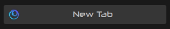

Context Menu:

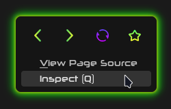 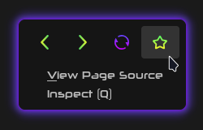

 Extensions Menu:
 
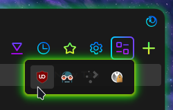 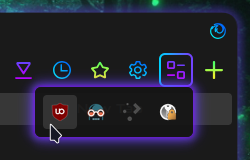

Linux (with titlebar):

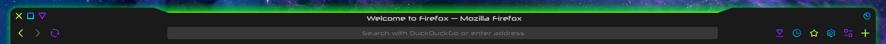

Linux (without titlebar):

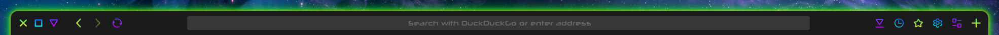

Windows:

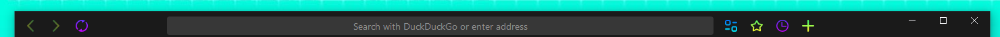

Mac:

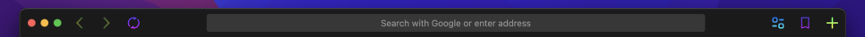

## Installation:

- Download and extract Xenofox-main.zip

- Type "about:support" in the Firefox URL bar to go to Firefox's support page

- Click "Open Directory" ("Open Folder" on Windows) next to the "Profile Directory" ("Profile Folder" on Windows) label to open your Firefox Profile folder.

        Linux: ~/.mozilla/firefox/######.default-release/
        Windows: C:\Users\[USERNAME]\AppData\Roaming\Mozilla\Firefox\Profiles\######.default-release
        Mac: Users/[USERNAME]/Library/Application Support/Firefox/Profiles/######.default-release

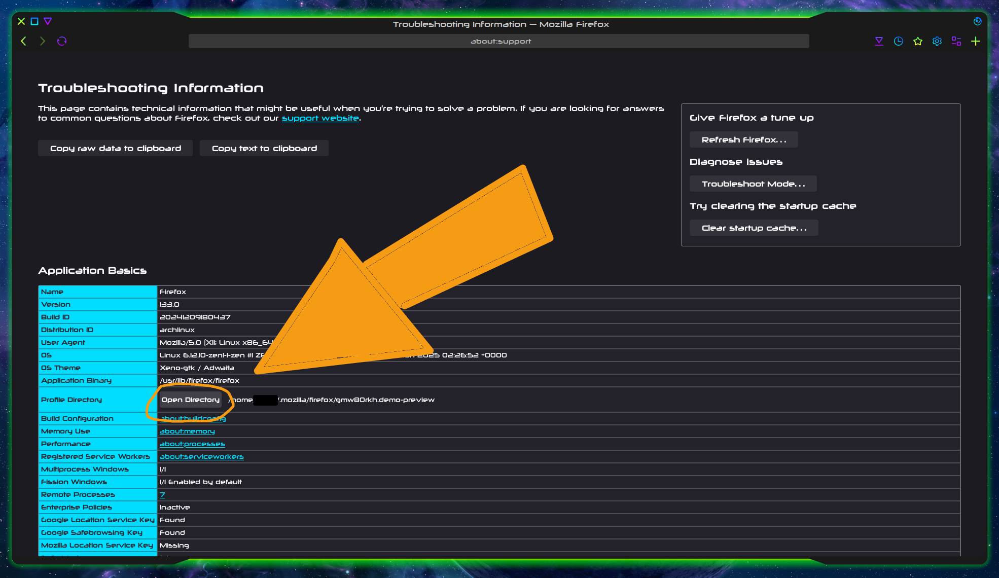

- Go to where you extracted Xenofox-main.zip. Copy the "chrome" folder and the "user.js" file to your Firefox profile folder. This step is complete when you have a file named "user.js" and a folder named "chrome" (that contains the theme's components) in your Firefox Profile folder

- Restart Firefox

### A few tweaks are still needed to fully adapt Firefox to the theme.

### From a fresh Firefox profile, this is what we have so far:

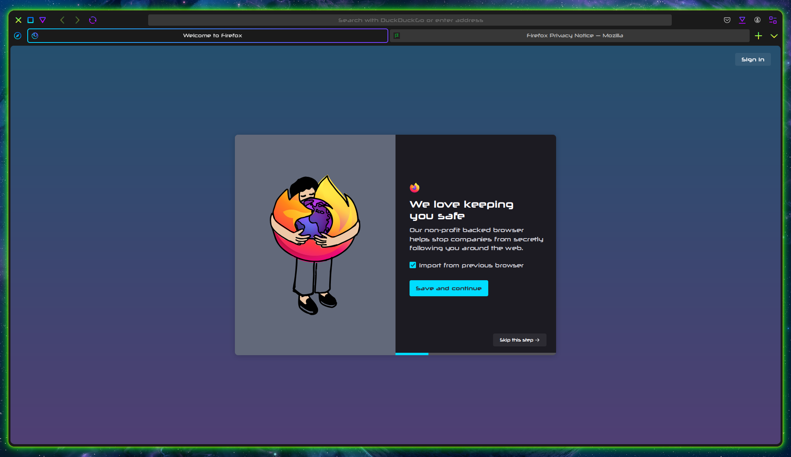

### To finish applying the theme:

- Right-click the toolbar and select "Customize Toolbar" to enter Customization mode
- Move the Firefox View button and the List All Tabs button off of the tab bar. Removing these buttons, or moving them to the toolbar, enables the tab bar to hide with only one tab. See Notes for further explanation
- Move the New Tab button from the tab bar to the right edge of the toolbar. Moving the New Tab button to the toolbar enables the tab bar to hide with only one tab. See Notes for further explanation
- KDE users: To have a titlebar, check the "Title Bar" checkbox in the lower-left. Consider disabling rounded corners for web content. See Notes for further explanation

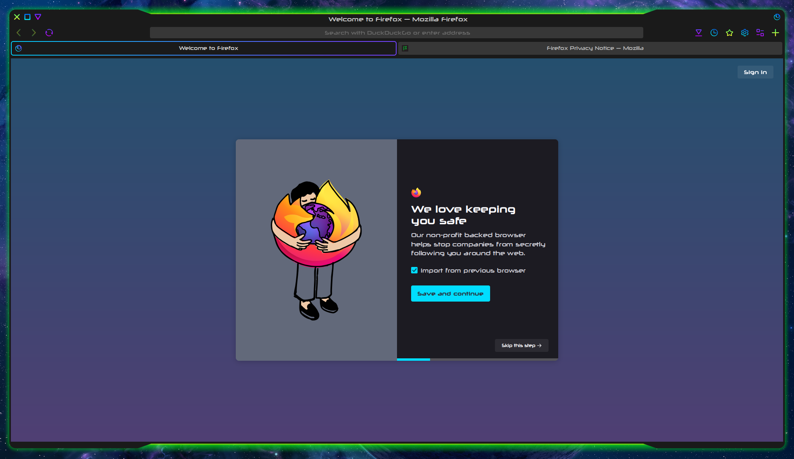

### The Xenofox theme has been applied!

## Recommendations:

### Xenofox is part of the Xeno theme suite
- Use with the [Xeno-gtk](https://github.com/tully-t/Xeno/tree/main/GTK) GTK theme (Linux only) (or [Xenon-gtk](https://github.com/tully-t/Xenon/tree/main/GTK), or [Xenoviolet-gtk](https://github.com/tully-t/Xenoviolet/tree/main/GTK))
- Use with the [Xeno](https://github.com/tully-t/Xeno/tree/main/Aurorae) Aurorae window decoration (KDE only) (or [Xenon](https://github.com/tully-t/Xenon/tree/main/Aurorae), or [Xenoviolet](https://github.com/tully-t/Xenoviolet/tree/main/Aurorae))

### Dark Reader
- Install the Dark Reader add-on and import the provided Dark Reader settings to give web content a dark theme (including pages restricted by the browser)

    To import Dark Reader settings:
    - Click the Extensions button to open the Extensions menu
    - Select Dark Reader. This will open the Dark Reader menu
    - Select "Dev tools" in the lower-right. The Dark Reader Developer Tools window will open
    - Select "Preview new design", click Apply, and close the dev tools window. This will enable a more advanced Dark Reader menu
    - Repeat steps 1 & 2 to open the Dark Reader menu again, this time with the new design
    - Select "Settings" (towards the bottom, above "Help"). The Dark Reader Settings page will open in a new tab
    - Select "Advanced" in the sidebar of the Dark Reader settings page
    - Select "Import Settings" (roughly in the middle, above "Export Settings" and below "Notify of news"). A file picker dialog will open
    - Navigate to where you extracted Xenofox.zip. In .../Xenofox/Dark-Reader-Settings, select "Dark-Reader-Settings.json"
    - Dark Reader now matches the Xenofox theme!

## Options:

### Purple glow

- In userChrome.css, comment out the "menus-green.css" line and uncomment the "menus-purple.css" line. For example:
```
@import url(menus-green.css); -> /*@import url(menus-green.css);*/
```
```
/*@import url(menus-purple.css);*/ -> @import url(menus-purple.css);
```
- In userContent.css, comment out the first `.top-site-outer .context-menu{}` section and uncomment the second `.top-site-outer .context-menu{}` section. Further instructions are available within userContent.css.

### To disable rounded corners for web pages

- In userChrome.css, comment out comment out the "rounded-corners-web-pages.css" line. For example:
```
@import url(hide-tracking-protection.css); -> /*@import url(hide-tracking-protection.css);*/
```

### Hidden Firefox components

- By default, this theme will hide the Tracking Protection icon from the URL bar. Tracking Protection is still working! I've never needed to interfere with it, and the icon is _always_ there otherwise. If you would feel better with it visible:
    - Comment out the `hide-tracking-protection.css` line userChrome.css. For example:
    ```
    @import url(rounded-corners-web-pages.css); -> /*@import url(rounded-corners-web-pages.css);*/
    ```
    - Restart Firefox to see changes

- For a visible Application (hamburger) menu (it is unmovable):
    - Comment out the `hide-hamburger-menu.css` line in userChrome.css. For example:
    ```
    @import url(hide-hamburger-menu.css); -> /*@import url(hide-hamburger-menu.css);*/
    ```
    - Restart Firefox to see changes
    - Explanation: Since we have the New Tab button on the toolbar, it makes the most sense to have it on the right edge, but that spot is taken by default by the hamburger menu, which is also unmovable. The smoothest way to approach this conflict is to hide the hamburger menu, which is redundant anyway, since all the function it provides is also provided by toolbar buttons or the menubar. The Overflow button will also appear at the right edge, but will be hidden unless there is an item in the Overflow menu. You can drag items out of the Overflow menu in Customization mode.

- For default Mozilla icons:
    - Comment out the `icons.css` line in userChrome.css. For example:
    ```
    @import url(icons.css); -> /*@import url(icons.css);*/
    ```
    - Restart Firefox to see changes

- To reveal the hidden context menu entries:
    - Comment out the `hide-some-context-menu-entries.css` line in userChrome.css. For example:
    ```
    @import url(hide-some-context-menu-entries.css); -> /*@import url(hide-some-context-menu-entries.css);*/
    ```
    - Restart Firefox to see changes
    
## Notes:

- Where did the close buttons on my tabs go?
    - Use middle-click or Ctrl+W to close inactive/unselected tabs. To reveal the close button on the selected tab, hover over it.

- KDE users: To have a titlebar, check the "Title Bar" checkbox in the lower-left. This will make Firefox use your Aurorae window decoration. Without a titlebar, Xenofox is the same on KDE and GTK, and will use your GTK theme to provide client-side decoration buttons. 

    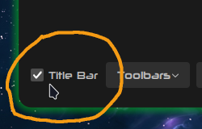

- Xenofox provides a user.js file. If you choose not to use it, you have to visit about:config to enable themes. On the about:config page, search for "toolkit.legacyUserProfileCustomizations.stylesheets" and set the preference to "true"

- The provided user.js file will apply on Firefox startup and overwrite any changes you make in about:config to its listed prefs. To change any of the prefs in the provided user.js, modify the user.js file directly, or rename or remove user.js from your directory folder.

- Arkenfox compatibility: append the prefs in the provided user.js to your user-overrides.js

## Customization:

- Always make a backup first. Feel free to experiment! The theme .css files are deliberately commented to make modification approachable.

- To change colors: Use Ctrl+F to search for specific colors within .css files. If you change the selected tab gradient in tab-theme.css, you may also want to change the opened button gradients, the --panel-separator-zap-gradient, and the warning container gradient in toolbars.css, the focused URL bar background gradient in urlbar.css, and the Top Site context menu gradient in userContent.css. Colors may be found in more than one place. Check tab-theme.css, toolbars.css, urlbar.css, and userContent.css

- To change the New Tab favicon (by default a blue Firefox logo), edit line 4 in chrome/icons.css. Several alternative New Tab favicons are provided. For example, replace the "newtab-logo.svg" of `content: url(icons/newtab-logo.svg) !important;` with "firefox-logo.svg" (green alternative icon), "firefox-nightly.svg" (purple Firefox Nightly icon), or "librewolf-logo.svg" (purple Librewolf icon).
    - You can also edit the color of the provided icons using Inkscape or rename them as you see fit. Use the gradients in other provided icons as models.

- All icons that you add or modify should be sized 32x32px to scale correctly

- To modify the theme for the New Tab page/Top Sites, edit variables in userContent.css

### Known issues:

- Native pages (about: pages, etc.) are not yet entirely themed

### Uninstallation:

- Delete the "chrome" folder in your Firefox profile folder
- In Extensions -> Dark Reader -> Settings -> Advanced, choose "Reset settings"
- Right-click the Toolbar and select "Customize Toolbar". In Customization Mode, select "Restore Defaults" (lower-right)
- In about:config, reset the preferences listed in "user.js" to default, then delete "user.js" before closing Firefox
- Restart Firefox. Your browser is back to default!

### Contributing

Please open an issue if you notice any bugs, errors, or unexpected behavior.

### Authors

* **Tully Turk**

### License

This project is licensed under the GPL v3.0 License - see the [LICENSE.md](LICENSE.md) file for details

### Acknowledgments

This theme would not exist without the tremendously patient and insightful guidance from MrOtherGuy provided to the public in comments on r/firefoxcss and https://lemmy.world/c/firefoxcss, as well as their templates at https://github.com/MrOtherGuy/firefox-csshacks/tree/master.

Thank you to Mozilla for enabling CSS modification of the Firefox UI.
